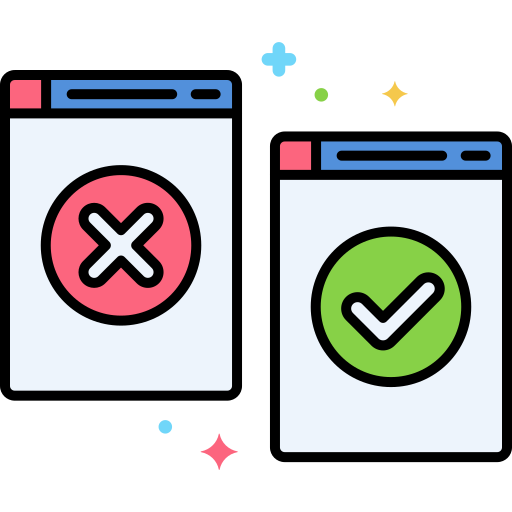
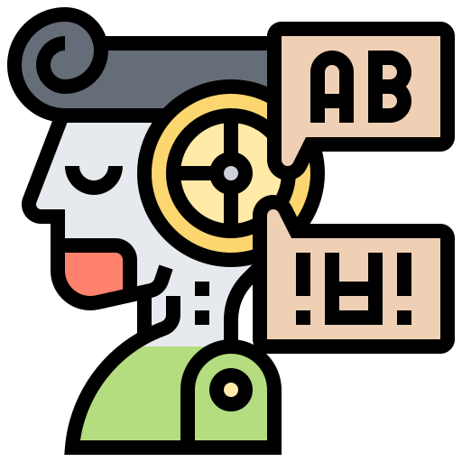
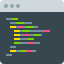
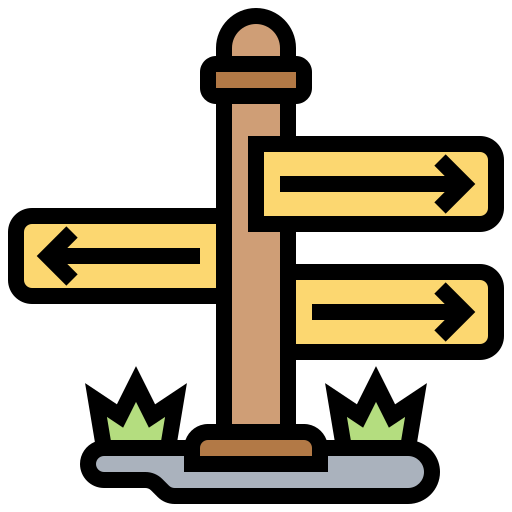

  

    
<h1 align="center">
  <h2 align="center"><strong align="center"> Corretor Ortografico (NLP) </strong></h2>
</h1>

 

<h2> Descrição </h2>

  Um corretor ortográfico usando Python.

 

<h2> A ideia </h2>

  

 

  O projeto foi feito no curso <a href="https://cursos.alura.com.br/course/nlp-corretor-ortografico" target="_blank">Corretor Ortográfico em Python: Aplicando técnicas de NLP</a> da plataforma <a href="https://www.alura.com.br/" target="_blank">Alura</a>.

Ao final da primeira aula, esse curso já estava na lista dos meus TOP 3 cursos que fiz nessa plataforma. Thiago Gonçalves Santos, o intrutor do curso, de maneira extremamente didática nos ensina a aplicar algumas técnicas da Linguagem de Processamento Natural (NLP) para construir um corretor ortográfico.

 

  Foi utilizada a biblioteca:
  <ul>
    <li> nltk </li>
  </ul>  

 

<h2> Como usar? </h2>

  Basta ter uma conta Google, abrir o notebook no colaboratory e baixar os arquivos <code>treinamento.txt</code> (para treinar o algoritmo) e <code>palavras.txt</code> (para fazer a avaliação do algoritmo).

 

<h2> Fonte dos textos </h2>
<ul>
    <li>Os textos utilizados para o treinamento do algoritmo bem como as palavras para avaliá-lo, foram fornecidos pelo próprio curso.</li>
</ul>
 

<h2> Próximas etapas </h2>
<ul>
  <li>Montar o meu prórpio arquivo de texto para treinamento do algoritmo através de web scraping (talvez?)</li>
  <li>Melhorar a taxa de acertos do corretor. (Qualquer ajuda para juntar as funções criadas é muito bem vinda!)</li>
 

<h2> Agradecimentos </h2>

<ul>
  <li><a href="https://www.linkedin.com/in/thiago-gonçalves-santos/" target="_blank"> Thiago Gonçalves Santos </a> (pelo excelente curso)</li>
</ul>

  
    <adress>
      Icons made by (from <a href="https://www.flaticon.com/br/" target="_blank" title="Flaticon"> www.flaticon.com</a> and <a href="https://icon-icons.com/pt/" target="_blank" title="Icon-Icons">www.icon-icons.com/pt/</a>):
      <ul>
        <li><a href="https://www.flaticon.com/br/autores/kiranshastry" target="_blank" title="Kiranshastry">Kiranshastry</a>;</li>
        <li><a href="https://www.flaticon.com/br/autores/eucalyp" target="_blank" title="Eucalyp">Eucalyp</a>;</li>
        <li><a href="https://www.flaticon.com/br/autores/freepik" target="_blank" title="Freepik">Freepik</a>;</li>
        <li><a href="https://www.flaticon.com/br/autores/becris" target="_blank" title="Becris">Becris</a>;</li>
        <li><a href="https://www.flaticon.com/br/autores/eucalyp" target="_blank" title="Eucalyp">Eucalyp</a>;</li>
        <li><a href="https://www.flaticon.com/br/autores/smalllikeart" target="_blank" title="smalllikeart">smalllikeart</a>;</li>
        <li><a href="https://www.flaticon.com/br/autores/ultimatearm" target="_blank" title="ultimatearm">ultimatearm</a>.</li>
      </ul>
    </adress>
  

 

<h2> Autor </h2>

<table>
  <tr>
    <td align="center"><a href="https://www.linkedin.com/in/vini-antunes/" target="_blank"> <b>Vini Antunes</b></a> </td>
  <tr>
</table>

 
PS: Os textos daqui e dos comentários no código não passaram pelo corretor ortográfico.
